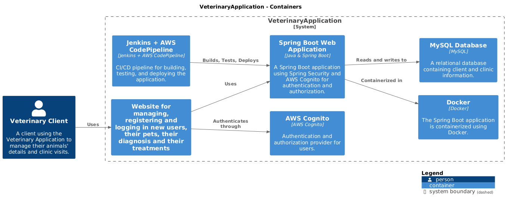
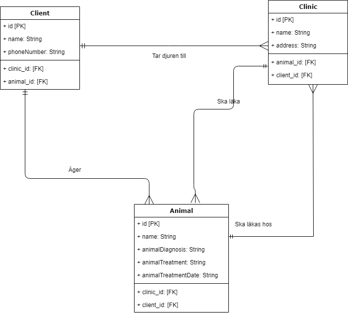
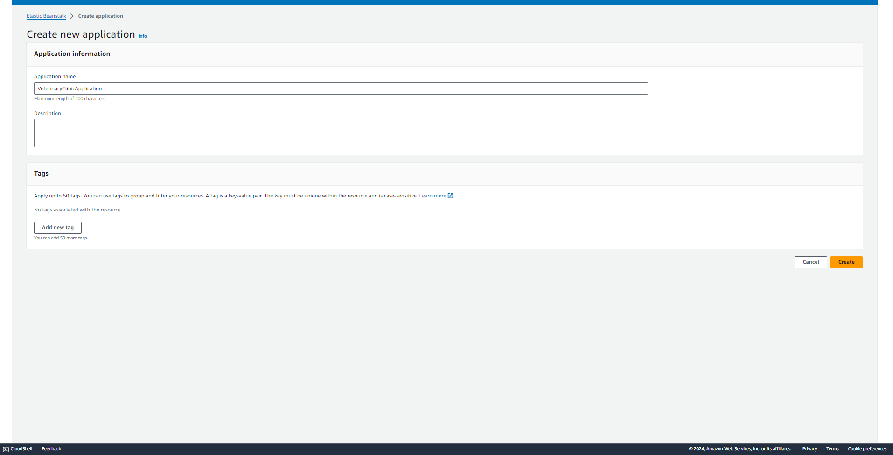
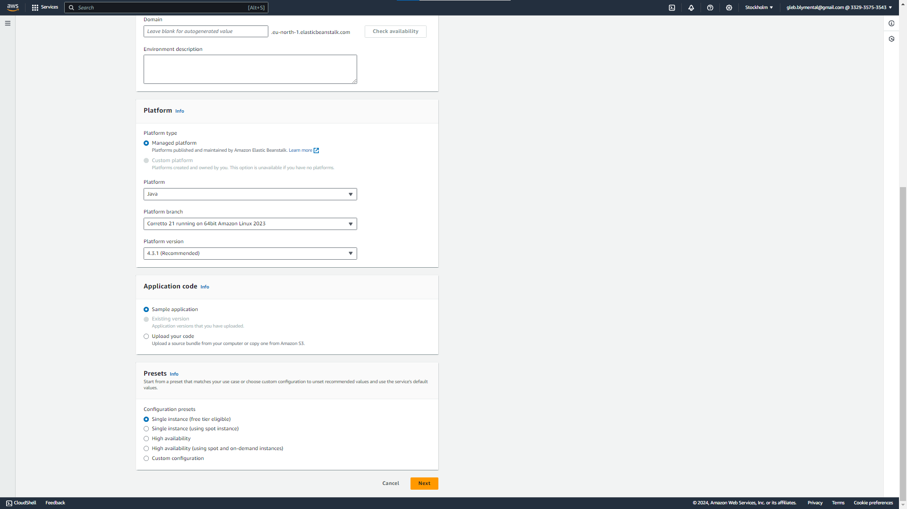
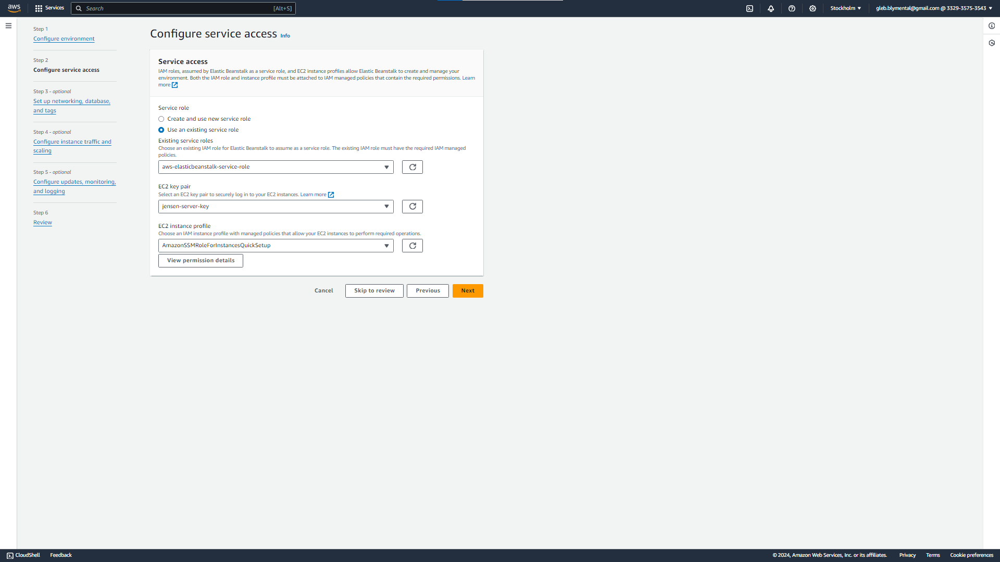
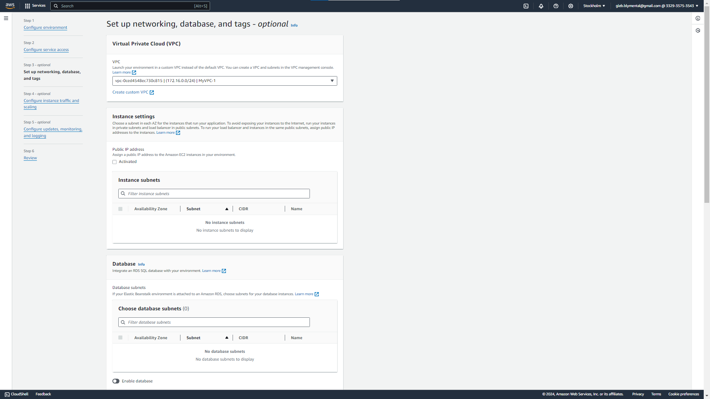
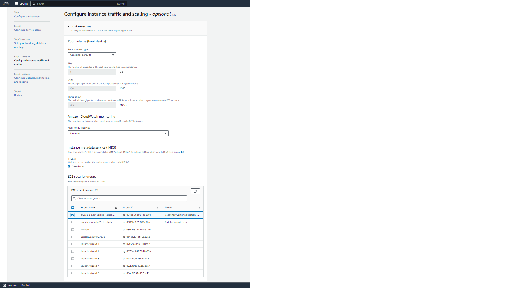
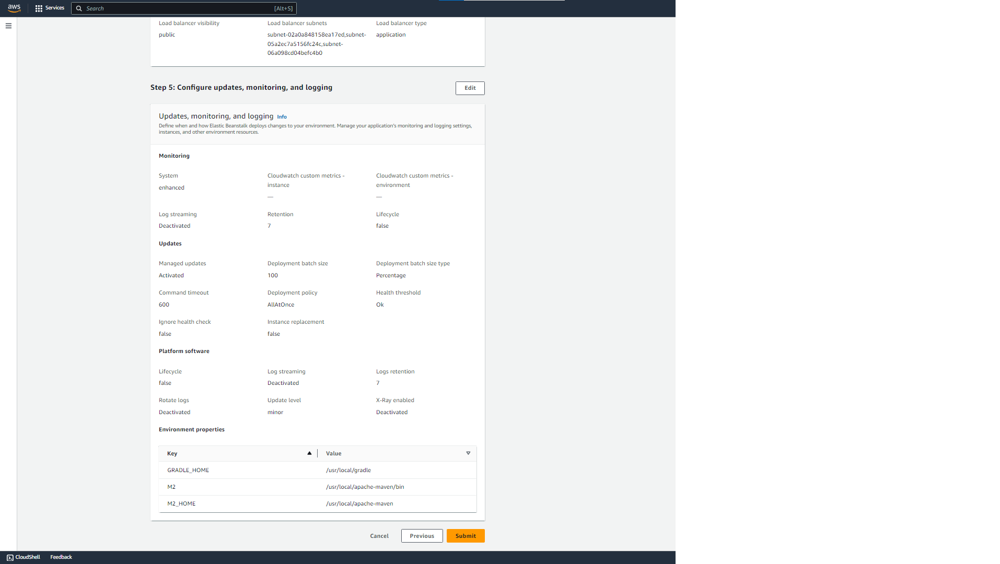
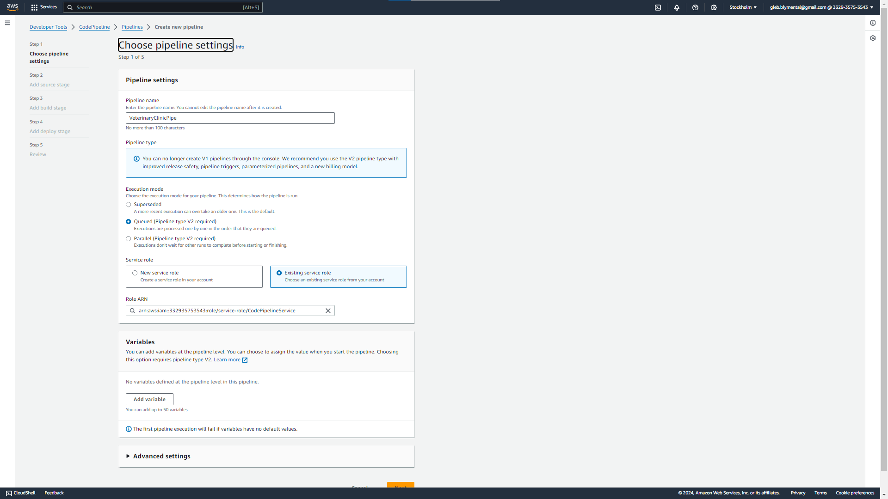
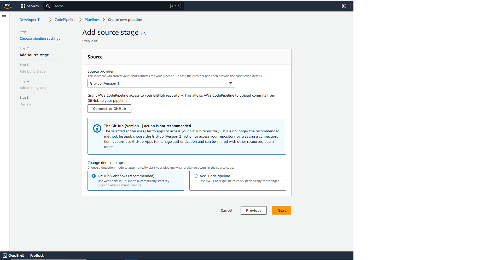

# Veterinary Clinic Management System

## 1. URL till Web Application
[Access the Web Application](https://your-application-url.com)  
WIP

## 2. Sammanfattning
Denna dokumentation ger en omfattande guide till Veterinary Clinic Management System, inklusive en kort översikt över
applikationen, databasstrukturen och driftsättningsstrategier. Den jämför också olika driftsättningsmetoder och ger
steg-för-steg-instruktioner för att konfigurera och köra programmet med hjälp av Jenkins i kombination med AWS Pipeline.

## 3. Applikationsdiagram och databasdiagram
Följande diagram visar strukturen för både den applikationen och databasen som används i detta program, 
inklusive tjänster, driftsättningsmetoder, tabellerna och deras relationer.

### Tabeller och relationer
- **Klient**: Lagrar klientinformation, inklusive uppgifter om Animal som ”animalName”, ”animalType” och ”animalSickness”.
- **Klinik**: Lagrar klinikinformation som `name` och `address`.
- **Djur**: Länkar `Client` och `Clinic` genom
- genom behandlingsrelaterad information (`animaltreatment`, `animaltreatmentdate`),
- och har en `Many-to-One`-relation med båda tabellerna.

## 4. Applikationsöversikt
**Veterinary Clinic Management System** är en webbaserad applikation som är utformad för att hantera
veterinärklinikens verksamhet. Systemet gör det möjligt för klinikpersonalen att hantera klient- och klinikinformation, 
inklusive de djur som behandlas på kliniken, behandlingsdetaljer och klientens djurhälsohistorik.
Plattformen är skräddarsydd för att effektivisera processen med att boka, hantera och spåra djurbesök,
för att säkerställa en smidig verksamhet för både veterinärer och deras kunder.

## 5. Driftsättningsmetoder

### Method 1 AWS Elastic Beanstalk med AWS PipeLine

#### Varför just den?
AWS Elastic Beanstalk är en helt hanterad tjänst som automatiserar driftsättningen och hanteringen av applikationer 
på AWS. Det är enkelt att använda och integreras väl med AWS CodePipeline för CI/CD-flöden. Genom att använda Beanstalk 
undviker du att manuellt hantera infrastrukturen och kan fokusera mer på applikationsutveckling.

#### Steg-för-steg-driftsättningsprocess:
1. **Förbered AWS Elastic Beanstalk Miljö:**:
    - Logga in på AWS Management Console.
    - Navigera till AWS Elastic Beanstalk och skapa en ny applikation.
    - Välj rätt plattform (Java i vårt fall) beroende på din applikation.
    - Skapa en miljö (t.ex. för produktion eller test) och välj önskad infrastruktur (EC2, Load Balancer, etc.).
    - Länk till Elastic Beanstalk-dokumentation:
    - Steg för steg bilder:
      
      
      
      
      
      
      
      
    - Länk till guide om Jenkins installation:
      !(https://docs.aws.amazon.com/elasticbeanstalk/latest/dg/Welcome.html)

2. **Skapa AWS CodePipeline**:
    - Logga in på din AWS Management Console.
    - Navigera till **AWS CodePipeline** och skapa en ny pipeline.
    - Anslut pipelinen till ditt GitHub-repository.
    - Konfigurera bygg- och driftsättningssteg med hjälp av AWS CodeBuild- och CodeDeploy-tjänsterna.
    - Steg för steg bilder:
      
      
    - Dokumentation:
      !(https://docs.aws.amazon.com/codepipeline/latest/userguide/welcome.html)

3. **Konfigurera AWS CodeBuild:**:
    - Under byggsteget i CodePipeline, skapa ett nytt AWS CodeBuild-projekt.
    - Välj den byggmiljö som passar din applikation (Vi använder Amazon Linux).
    - Definiera byggspecifikationen (buildspec.yml) som talar om för CodeBuild hur applikationen ska byggas och paketeras.
    - Dokumentation om CodeBuild:
      !(https://docs.aws.amazon.com/codebuild/latest/userguide/welcome.html)

4. **Automatisera driftsättningen med Elastic Beanstalk:n**:
    - I distributionssteget av pipelinen, välj den Elastic Beanstalk-miljö som du förberett tidigare.
    - Pipelinen kommer automatiskt att distribuera den byggda applikationen till din Elastic Beanstalk-miljö efter varje framgångsrik build.
    - Du kan även ställa in olika miljöer (t.ex. test, staging, produktion) för kontinuerliga driftsättningar.

5. **Kör och verifiera distributionen:**
    - När du pushar kod till GitHub kommer AWS CodePipeline automatiskt att starta bygg- och distributionsprocessen.
    - När pipelinen är klar distribueras applikationen till Elastic Beanstalk och du kan besöka dess offentliga URL för att verifiera att allt fungerar korrekt.
    - Övervaka och hantera driftsättningen via Elastic Beanstalk Dashboard eller AWS CLI.

## 6. Jämförelsen mellan olika driftsättningsmetoder

### Jenkins med AWS Pipeline
#### Fördelar:
- Helt automatiserad CI/CD pipeline.
- Mycket anpassningsbar och stödjer komplexa arbetsflöden.
- Integreras väl med andra AWS-tjänster som S3, EC2 och Elastic Beanstalk.

#### Nackdelar:
- Kräver mer installation och konfiguration.
- Potentiellt högre kostnader på grund av att flera tjänster är inblandade (t.ex. CodeBuild, CodeDeploy, Jenkins-server).

### AWS Elastic Beanstalk med Jenkins
#### Fördelar:
- AWS Elastic Beanstalk förenklar driftsättningsprocessen genom att hantera infrastrukturen automatiskt.
- Jenkins gör driftsättningen mer flexibel och behöver inte hålla sig till AWS ecosystemet, som också minskar kostnader.
- Lika skalbar som de andra

#### Nackdelar:
- Jenkins är lite utdaterat (tycker jag) och ifall det händer något bugg med själva programvaran, det är mycket svårt att
fixa den.
- Kopplas inte lika bra till AWS Elastic Beanstalk som andra AWS tjänster.

### AWS EC2 med Jenkins
#### Fördelar:
- Full kontroll över EC2-instansen, vilket möjliggör anpassade serverkonfigurationer och driftsättningsmiljöer.
- Jenkins kan konfigureras för att stödja alla teknikstackar eller distributionsstrategier.

#### Nackdelar:
- Kräver manuellt ingripande för skalning, övervakning och lastbalansering.
- Kräver underhåll av Jenkins-servern och EC2-instansen.

### AWS EC2 med AWS Beanstalk
#### Fördelar:
- AWS Beanstalk hanterar driftsättning, skalning och övervakning av applikationer som körs på EC2-instanser.
- Förenklar distributionen, vilket gör det lättare för team att hantera applikationer utan djup infrastrukturkunskap.

#### Nackdelar:
- Begränsad kontroll över de underliggande EC2-instanserna jämfört med att hantera dem direkt.
- Stöder kanske inte alla anpassade konfigurationer och inställningar som är möjliga med fristående EC2.

### AWS EC2 med AWS Pipeline
#### Fördelar:
- Kombinerar flexibiliteten hos EC2 med automatiseringsmöjligheterna hos AWS Pipeline för CI/CD.
- Möjliggör anpassade serverkonfigurationer samtidigt som man drar nytta av automatiserad driftsättning.
#### Nackdelar:
- Mer komplex installation jämfört med hanterade tjänster som Elastic Beanstalk.
- Kräver löpande underhåll av EC2-instanser och konfigurationer.

## 7. Slutsats
I det här projektet valdes Jenkins i kombination med AWS Pipeline för driftsättning på grund av dess 
stabila automatiseringsfunktioner och flexibilitet. Utöver detta, så valde jag att containernisera projektet med
Docker för mer flexibiletet med projektets underhåll, mer säkerhet och integration med Jenkins och CodePipeline. 
Vidare så övade jag mer på att skapa databaser med olika tabeller som relaterar till varandra och lösa möjliga problem med de.
Sist så övade jag på att använda AWS Cognito som var väldigt nyttigt, eftersom jag hade lite problem med den förra 
terminen.

---
